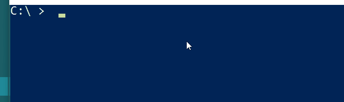

# posh-azurecli

**PLEASE NOTE: This module targetted the v1 Azure CLI (`azure`) and does not work with the v2 CLI (`az`)**
**As such, this repo is now read-only and no longer maintained**

Provides tab completion for [azure cli](https://azure.microsoft.com/en-us/documentation/articles/xplat-cli/) commands in PowerShell

Inspired by [posh-git](https://github.com/dahlbyk/posh-git)

PLEASE NOTE: This is NOT a supported extension to Azure CLI!



## Installation etc

### PowerShell Gallery

You can install [posh-azurecli](https://www.powershellgallery.com/packages/posh-azurecli/) via the [PowerShell Gallery](https://www.powershellgallery.com/)

```powershell
Install-Module -Name posh-azurecli
Install-AzureCliCompletion
```

If you update the CLI version then run the following to regenerate the metadata for completion
```powershell
Reset-AzureCliCompletion
```

And to uninstall run
```powershell
Uninstall-AzureCliCompletion
Remove-Module posh-azurecli
Uninstall-Module -Name posh-azurecli
```

### Chocolatey

Ensure that you have [chocolatey](https://chocolatey.org/) installed.


Milestone drops are waiting on chocolatey moderation. I'll update this page once available :-)

There is also a [non-milestone feed](https://www.myget.org/F/posh-azurecli/api/v2) now up on MyGet. 
To install these interim drops use:

```
    choco install posh-azurecli -source 'https://www.myget.org/F/posh-azurecli/api/v2'
```

## Release Notes

## 0.1.9
Released to non-milestone feed 17th December.
Released to PowerShell Gallery 17th December.
* Update Install-AzureCliCompletion to trigger Reset-AzureCliCompletion to simplify installation

## 0.1.8
Released to non-milestone feed 17th December.
Released to PowerShell Gallery 17th December.
* Add Install-AzureCliCompletion, Uninstall-AzureCliCompletion

## 0.1.7
Released to non-milestone feed 17th December
* Add Reset-AzureCliCompletion cmdlet to regenerate CLI metadata for completion. This helps towards PowerShell Gallery listing.

## 0.1.6
Released to non-milestone feed 2nd November 2015
* Fixed version test on installation


## 0.1.5
Released to non-milestone feed 19th August 2015
* Add handling to use the first path for Azure CLI installation
* Add debug output (POSH_AZURECLI_DEBUG flag)

## 0.1.4
Released to non-milestone feed 18th August 2015
* Add a version check on Azure CLI in chocolatey install (requires >= 0.9.7)
* Update path to license file in nuspec

### 0.1.3
Released to non-milestone feed 18th August 2015
* Update to utility function to handle PATH strings with empty segments

### 0.1.2 
Released to non-milestone feed: 14th August 2015
* Provide command completion for initial command
* Sort command completion results
* Add caching of parsed command metadata
 
### 0.1.1
Released to non-milestone feed: 14th August 2015
* Basic functionality
